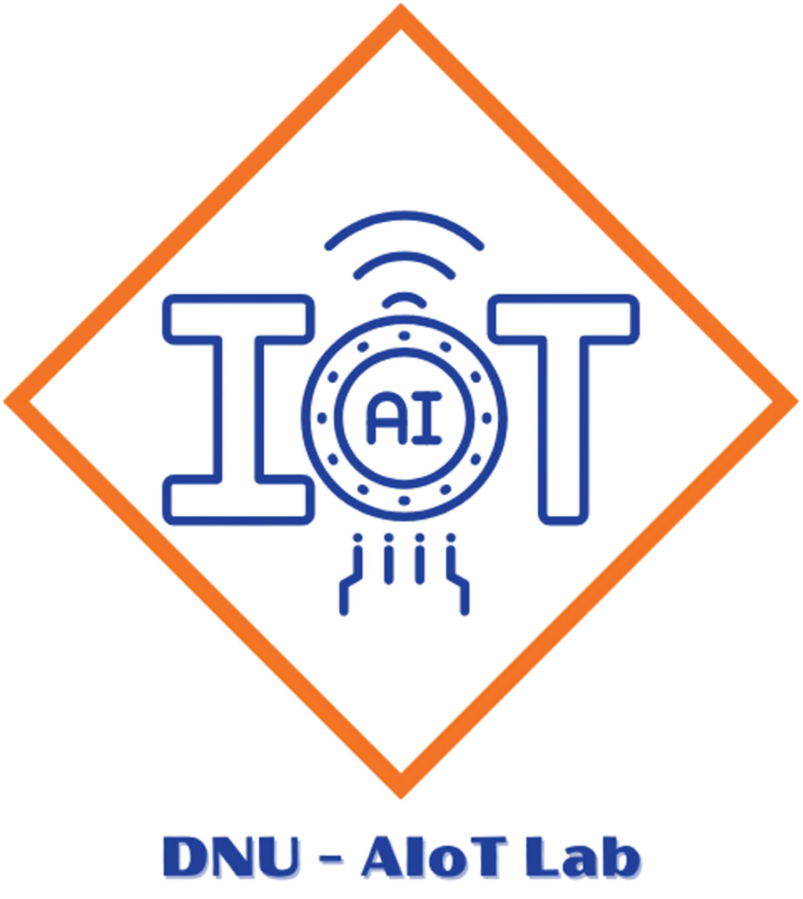

<h1 align="center">HỆ THỐNG PHÁT HIỆN CHUYỂN ĐỘNG VÀ NHẬN DIỆN KHUÔN MẶT TRONG GIÁM SÁT AN NINH </h1>

<div align="center">

<p align="center">
  
  
</p>

[](https://www.facebook.com/DNUAIoTLab)
[](https://fitdnu.net/)
[](https://dainam.edu.vn)

</div>
<h2 align="center">Hệ Thống Phát Hiện Chuyển Động và Nhận Diện Khuôn Mặt</h2>

**Phát triển bởi Nhóm 4 Lớp CNTT 1601, Khoa Công nghệ Thông tin, Đại học Đại Nam**

## 🔬 Tăng cường An ninh với Công nghệ Giám sát Thông minh

Hệ thống thế hệ mới tích hợp phát hiện chuyển động và nhận diện danh tính, sử dụng OpenCV, YOLOv8 và DeepFace, hỗ trợ cảnh báo thời gian thực qua Telegram.

## 🏗️ Kiến trúc Hệ thống

### Tổng quan

Hệ thống hoạt động dựa trên kiến trúc đa luồng, bao gồm các thành phần chính:

- 📷 **Xử lý Video**: Thu thập video từ camera, phát hiện chuyển động bằng phương pháp trừ nền và nhận diện người với YOLOv8.
- 👤 **Nhận diện Danh tính**: Phát hiện khuôn mặt bằng OpenCV Haar Cascade và tạo embedding với DeepFace để nhận diện.
- 🚨 **Cảnh báo**: Gửi thông báo, ảnh và video qua Telegram, xử lý tác vụ bất đồng bộ để đảm bảo hiệu suất.

## ✨ Tính năng Nổi bật

### 🧠 Phát hiện Thông minh

- **Phát hiện Chuyển động**: Theo dõi chuyển động thời gian thực bằng cách so sánh khung hình.
- **Phát hiện Người**: Sử dụng YOLOv8 để nhận diện chính xác người trong video.
- **Nhận diện Khuôn mặt**: Áp dụng DeepFace (Facenet512) để khớp khuôn mặt với cơ sở dữ liệu.

### ⚡ Cảnh báo Thời gian thực

- **Tích hợp Telegram**: Gửi ảnh, video và cảnh báo tức thì qua Telegram.
- **Lệnh Tùy chỉnh**: Hỗ trợ `/photo`, `/record`, `/warning` để điều khiển thủ công.
- **Độ trễ Thấp**: Xử lý cảnh báo trong 0.5 giây, với khoảng cách giữa các cảnh báo là 5 giây.

### 📊 Hiệu suất Cao

- **Xử lý Bất đồng bộ**: Sử dụng luồng riêng để xử lý tác vụ, đảm bảo video mượt mà.
- **Lưu trữ Tối ưu**: Lưu ảnh và video vào các thư mục `alerts`, `manual_captures`, `videos`.
- **Tùy chỉnh Linh hoạt**: Điều chỉnh ngưỡng chuyển động và độ tương đồng theo nhu cầu.

## 🔧 Công nghệ Sử dụng

### Công nghệ Chính

- **Xử lý video và phát hiện khuôn mặt**
- **Phát hiện người**
- **Nhận diện danh tính**
- **Kết nối Telegram**

### Thư viện Hỗ trợ

- `numpy`, `torch`, `requests`, `pickle` - Tính toán và quản lý dữ liệu
- `threading`, `queue` - Đa luồng và hàng đợi tác vụ

## 📥 Hướng dẫn Cài đặt

### 🛠️ Yêu cầu

- 🐍 **Python 3.8+**: Ngôn ngữ chính
- 📷 **Camera**: Camera USB hoặc IP tương thích OpenCV
- 💾 **RAM 4GB+**: Tối thiểu (khuyến nghị 8GB)
- 💻 **CPU 2+ lõi**: Hỗ trợ xử lý song song
- 🖴 **Dung lượng 5GB+**: Lưu trữ ảnh, video và embeddings
- 🌐 **Kết nối Internet**: Cần thiết cho thông báo Telegram

### ⚙️ Các bước Cài đặt

#### 📦 Tải Repository

```bash
git clone https://github.com/AIoTLab-DNU/MotionIdentitySurveillance.git
cd MotionIdentitySurveillance
```

#### 🌟 Tạo Môi trường Ảo

```bash
python -m venv venv
source venv/bin/activate  # Trên Windows: venv\Scripts\activate
```

#### 📚 Cài đặt Thư viện

```bash
pip install -r requirements.txt
```

**Lưu ý**: Tạo file `requirements.txt` với nội dung:

```text
opencv-python
torch
numpy
telebot
requests
ultralytics
deepface
```

#### ⚡ Cấu hình Hệ thống

1. Tạo bot Telegram qua [BotFather](https://t.me/BotFather) để lấy `TELEGRAM_BOT_TOKEN`.
2. Lấy `TELEGRAM_CHAT_ID` bằng cách gửi tin nhắn cho bot và kiểm tra ID.
3. Cập nhật cấu hình trong file `surveillance.py`:

```python
TELEGRAM_BOT_TOKEN = "your_bot_token"
TELEGRAM_CHAT_ID = "your_chat_id"
```

#### 📂 Chuẩn bị Embeddings

- Đặt file `embeddings.pkl` vào thư mục gốc. File này chứa dictionary `{image_path: {"embedding": embedding_vector}}`.
- Nếu chưa có, xem phần **Thêm Khuôn mặt** để tạo.

## 🚀 Bắt đầu Sử dụng

### ⚡ Chạy Hệ thống

```bash
python surveillance.py
```

Hệ thống sẽ khởi động camera, phát hiện chuyển động, nhận diện danh tính và gửi cảnh báo qua Telegram.
Nhấn `q` trong cửa sổ OpenCV để thoát.

### 📸 Chụp Ảnh

Gửi lệnh `/photo` qua Telegram để chụp và nhận ảnh từ camera.

### 🎥 Quay Video

Gửi lệnh `/record` để quay video 10 giây và nhận qua Telegram.

### 🚨 Gửi Cảnh báo Thủ công

Gửi lệnh `/warning` để gửi cảnh báo qua Telegram.

## 📥 Thêm Khuôn mặt vào Cơ sở Dữ liệu

### Để thêm danh tính mới:

```python
from deepface import DeepFace
import pickle
import os

# Script mẫu để thêm khuôn mặt
face_img_path = "đường/dẫn/đến/face.jpg"
identity = "Nguyen Van A"

embedding = DeepFace.represent(
    img_path=face_img_path,
    model_name="Facenet512",
    detector_backend="opencv"
)[0]["embedding"]

# Tải hoặc tạo mới embeddings
if os.path.exists("embeddings.pkl"):
    with open("embeddings.pkl", "rb") as f:
        embeddings = pickle.load(f)
else:
    embeddings = {}

# Thêm embedding với nhãn danh tính
embeddings[f"known_faces/{identity}/{os.path.basename(face_img_path)}"] = {"embedding": embedding}

# Lưu lại file embeddings
with open("embeddings.pkl", "wb") as f:
    pickle.dump(embeddings, f)
print(f"Đã thêm {identity} vào cơ sở dữ liệu embeddings.")
```
## 📰 Poster
<p align="center">
  
</p>

## 📚 Tài liệu Hỗ trợ

Xem chi tiết tại:

- 📖 **Hướng dẫn Cài đặt**
- 👥 **Hướng dẫn Sử dụng**
- 🔧 **Tài liệu API**
- 🤝 **Hướng dẫn Đóng góp**

## 📝 Giấy phép

© 2025 AIoTLab, Khoa Công nghệ Thông tin, Đại học Đại Nam. Mọi quyền được bảo lưu.

---

**Phát triển với 💻 bởi AIoTLab, Đại học Đại Nam**

🌐 [Website](https://aiotlab-dnu.com) • 🔗 [GitHub](https://github.com/AIoTLab-DNU) • 📩 [Liên hệ](mailto\:contact@aiotlab-dnu.com)


